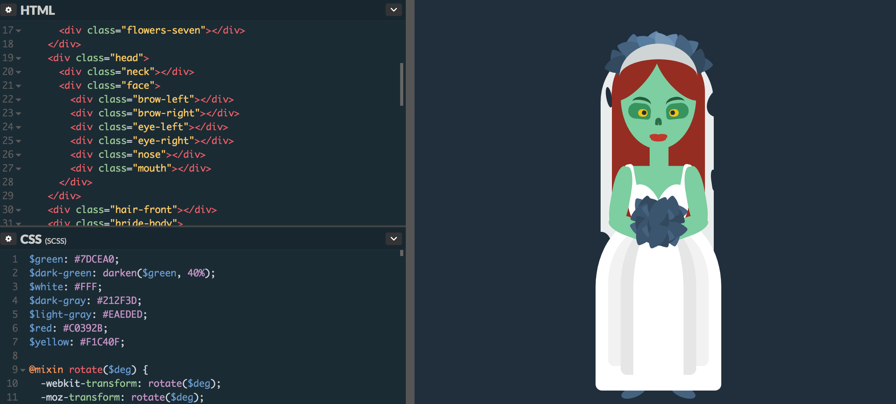
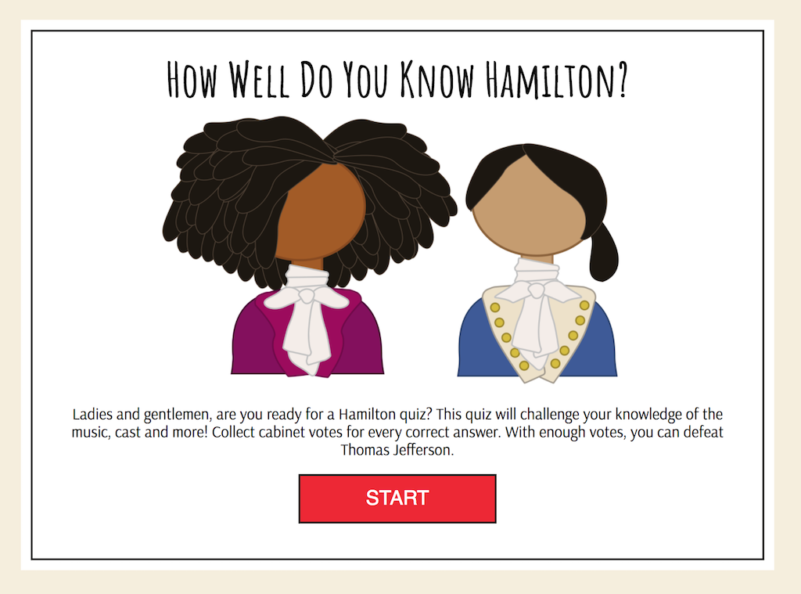
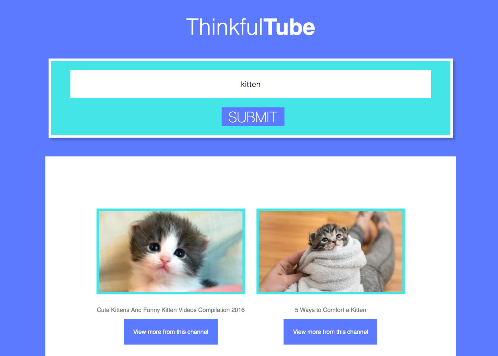
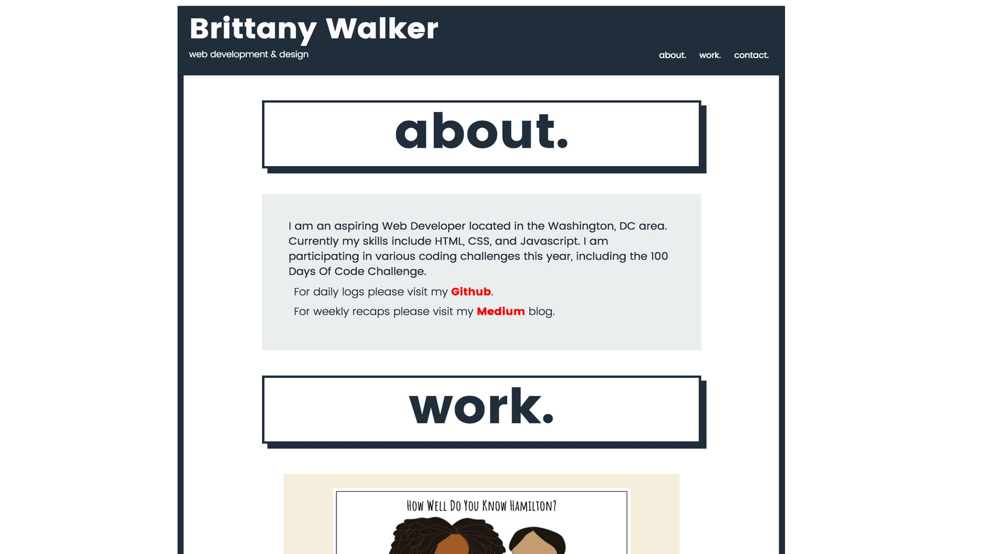
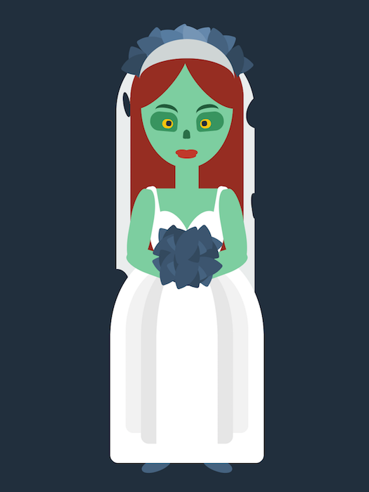

Below is a recap of everything that I accomplished during the past week.
> Completed a bunch of projects this week: JavaScript quiz, Free Code Camp portfolio, Youtube search API project and still managed to make a CSS image.

## Projects

### JavaScript Quiz

I completed the project and it works! This project was super fun and definitely helped me become more comfortable using jQuery. I will be able to utilize a lot of the concepts I learned for this in my next API project.

[Hamilton Quiz Demo](https://brittanyrw.github.io/hamilton-quiz-app/)

### Youtube API Project

The goal for this project was to pull Youtube video thumbnails and links from Youtube based on a user’s search. I still need to play around with the CSS and alignment but it functions.

[Youtube API Project Demo](https://github.com/brittanyrw/thinkful-tube)

### Free Code Camp Portfolio

I intended to only work on the mobile version of this but ended up completing the entire project. It is fully responsive and has a simple design. This was good practice for my final portfolio, which will include elements of this one (such as the boxes with the shadows). I decided to keep this simple so that I could continue with the rest of the Free Code Camp projects.

[Free Code Camp Portfolio Demo](https://brittanyrw.github.io/free-code-camp-portfolio/)

### API Project

I am working on an API project. So far I have identified an API and now I am working on defining the app’s functions and wire-framing.

### CSS Images

This week I created one CSS image. The prompt was ‘zombie’ so I created this zombie bride.

## What’s Next?

1. Work on my API project. I am currently wire-framing but my idea has started to become a little too complicated so I will need to simply it before I can start on actually coding.

2. Attend meetups! I will be attending more meetups next week, including more from Thinkful and a General Assembly event.

3. Create more CSS images and try to start the daily UI challenge as well.

To see my daily progress, follow me on Twitter [@musicalwebdev](https://twitter.com/musicalwebdev).

